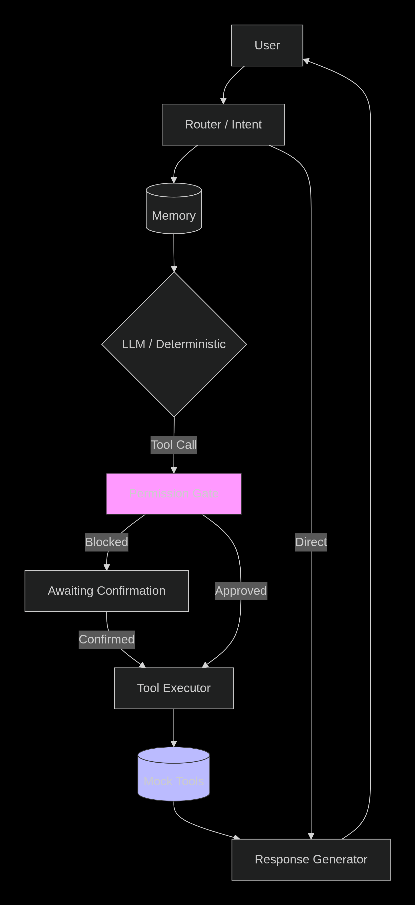
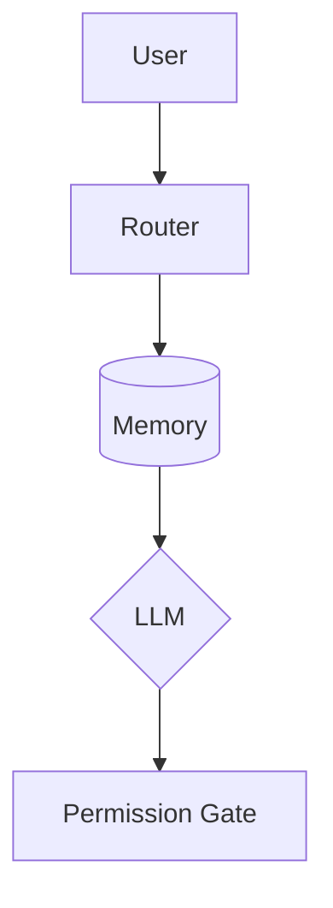

# Luna AI Core – Personalized Virtual Assistant (POC)

**Luna** is a proof‑of‑concept AI orchestration layer for a voice‑first, permission‑aware personal assistant. It combines deterministic routing, a local LLM (Ollama), mock tools, long‑term memory, and a robust permission system – all with full auditability.

---

## Features

- Natural language understanding via **Qwen2.5:7b** (CPU‑only, local)
- Four mock tools: Weather, Traffic, Calendar, Messaging (with Email support)
- **Permission Gate** – sensitive actions require explicit confirmation
- **Short‑term** (session) and **long‑term** (SQLite) memory
- **Proactive event** handling (traffic alerts)
- Full **audit trail** – every decision is logged
- **Dockerized** – one‑command deployment

---

## Quick Start (Local)

```bash
# Clone the repository
git clone https://github.com/ronincodex/luna-ai-core.git
cd luna-ai-core

# Create and activate Conda environment
conda create -n luna-env python=3.12 -y
conda activate luna-env

# Install dependencies and the package
pip install -r requirements.txt
pip install -e .

# Start Ollama (must be bound to 0.0.0.0 for Docker)
OLLAMA_HOST=0.0.0.0 OLLAMA_VULKAN=0 OLLAMA_GPU_OVERRIDE=0 OLLAMA_MODELS="$HOME/.ollama/models" ollama serve

# In another terminal, start Uvicorn
uvicorn luna.main:app --reload --host 0.0.0.0 --port 8000

# Test
curl -X POST "http://localhost:8000/chat" -H "Content-Type: application/json" -d '{"input": "What is your name?"}'

---

# Architecture




## Mermaid



# A simplified flow:

[User → Router → Memory (load) → LLM / Deterministic → Permission Gate → Tool → Response]:
The state machine (custom while loop) manages states: Routing, Executing, Awaiting_Confirmation, Responding, Complete, Failed. Every Transition is logged to the audit trail.


# Demo Video
[Watch the demo walkthrough video here](https:drive.google.com/file/d/16tA5_Mwno2fSnPa02-0hEqafeo2eXlGE/view?usp=sharing)
# Docker Deployment
## Build and run
docker compose build
docker compose up -d

## Check health
curl http://localhost:8000/health

## Stop
docker compose down

Note: Ensure Ollama is running on the host with OLLAMA_HOST=0.0.0.0 for Docker connectivity.

# Test Scenarios:
Run the automated test script
chmod +x test_all_scenarios.sh
./test_all_scenarios.sh

# Limitations
- Multi-step chaining is conceptual; production would add a dedicated PLANNING node.
- All tools are mocked, real integration require API keys and user consent.
- Offline mode is not fully implemented (only basic deterministic commands).
  
---

## License & Acknowledgements

© 2026 Saurabh Tiwari – Developed for IT WEBHUT AI Product R&D Assessment.

Built with:
- [FastAPI](https://fastapi.tiangolo.com/)
- [Ollama](https://ollama.com/) (Qwen2.5:7b)
- [SQLite](https://www.sqlite.org/)
- [Docker](https://www.docker.com/)


## Acknowledgements

This project was developed with the assistance of a **generative AI pair‑programming tool (DeepSeek)**, which supported architectural design, code refinement, and real‑time debugging during development.

All AI‑generated information was thoroughly reviewed, validated, and integrated by **Saurabh Tiwari**, who takes full ownership and responsibility for the final implementation, system architecture, providing research insight and product decisions.

The AI tool was used strictly as an accelerator – every architectural choice, security boundary, and production trade‑off was intentionally designed, tested and validated by the author to meet the specific requirements of the IT WEBHUT Luna AI Product R&D Assessment.
